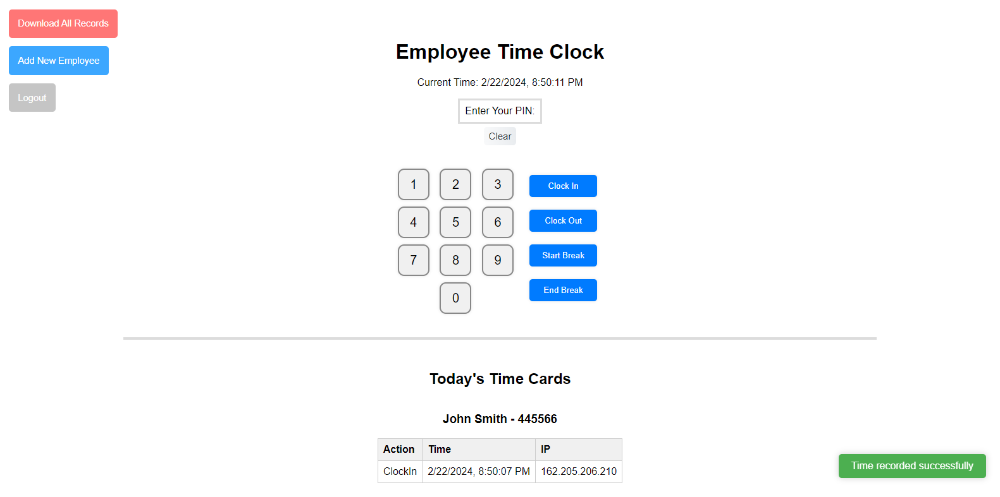

# 🕙 Employee Time Clock 🕐

A simple web-based employee time clock application built with React.

## Requirements

- [Node.js](https://nodejs.org/)

## Installation

1. **Clone the Repository**

   ```bash
   git clone https://github.com/judahpaul16/employee-time-clock.git
   cd employee-time-clock
   ```
   
2. **Install Dependencies**

   ```bash
   npm i
   ```

3. **Start the Application** (Development)

   ```bash
   # serves application to port 3001
   npm start
   ```

4. **Build the Application** (Production)

   ```bash
   # builds application in the 'dist' folder
   npm run build
   ```

## Usage

- Employees can navigate to their unique URL to clock in/out.
- Administrators can log in to the dashboard to view and manage time logs.

<!-- screenshot -->


## Example reclone script for production (Linux + Phusion Passenger)

   ```bash
   #!/bin/bash

   # Print the warning message
   echo ""
   echo "This script will reset the employee time clock database."
   
   # Prompt the user for confirmation
   read -p "Are you sure you want to continue? (y/n): " response
   
   # Check if the response is 'y' or 'Y'
   if [[ "$response" == "y" || "$response" == "Y" ]]; then
     echo "Recloning..."
     echo ""
   else
     echo "Operation canceled."
     echo ""
     exit 0
   fi
   
   rm -rf 'employee-time-clock/'
   git clone https://github.com/judahpaul16/employee-time-clock.git
   cd employee-time-clock
   npm i && npm rebuild bcrypt --build-from-source && npm run build && mkdir ./tmp && touch ./tmp/restart.txt
